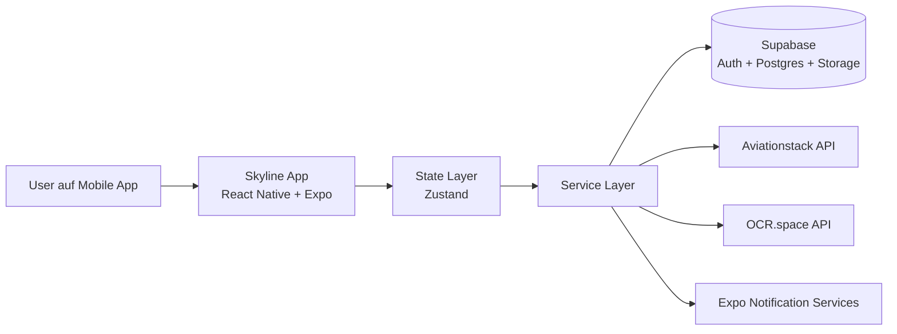
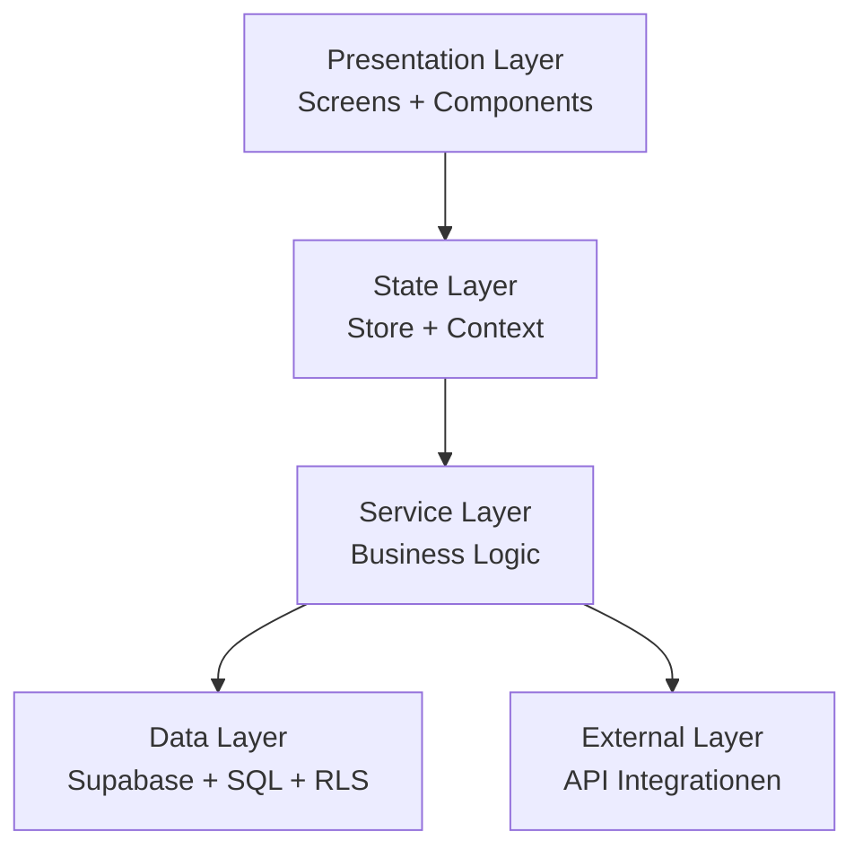
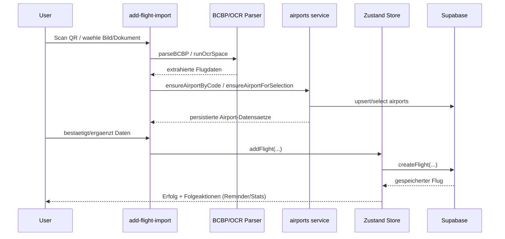
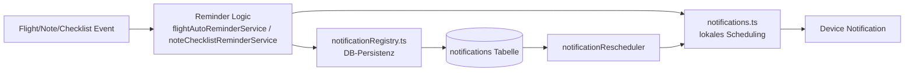
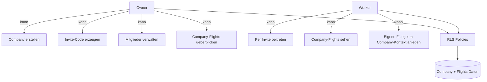
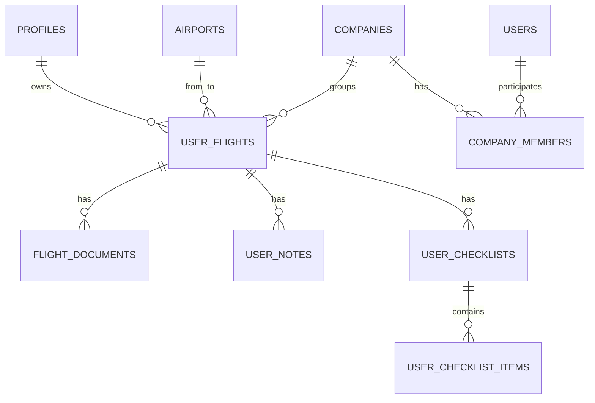

# Skyline - Architekturdiagramme

Dieses Dokument enthaelt Diagramme fuer die schriftliche Diplomarbeit.  
Empfehlung: Jedes Diagramm in der Arbeit mit einer Abbildungsnummer und Kurzbeschreibung versehen.

---

## Diagramm 1 - Gesamtsystem (Kontext)

---

## Diagramm 2 - Schichtenmodell intern

---

## Diagramm 3 - Flugimport End-to-End

---

## Diagramm 4 - Reminder/Notification Pipeline

---

## Diagramm 5 - Company Rollen und Zugriff

---

## Diagramm 6 - Datenmodell (vereinfacht)

