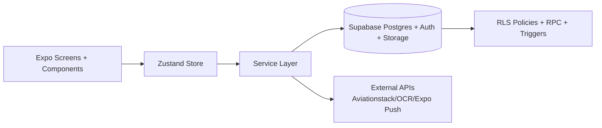

# Skyline - Vollständiges Projektprotokoll (schriftliche Diplomarbeit)

Stand: 2026-02-19  
Projekt: `Newest_Version_Skyline`  
Typ: Mobile Full-Stack Anwendung (React Native/Expo + Supabase/PostgreSQL)

---

## 1) Ziel dieses Dokuments

Dieses Dokument ist das zentrale, technische Projektprotokoll für die schriftliche Diplomarbeit.  
Es beschreibt das Skyline-Projekt von der Planung über Architektur und Umsetzung bis zu Testing, Betrieb und offenen Punkten - auf Full-Stack-Niveau.

Wichtig: Die Inhalte basieren auf dem aktuellen Repository-Stand, den vorhandenen SQL-Migrationen, Services, Screens und der Git-Historie.

---

## 2) Projektkontext und Problemstellung

Skyline löst das Problem, Flugreisen strukturiert zu erfassen und entlang der gesamten Journey zu begleiten:

- Flugerfassung (manuell, QR/BCBP, OCR)
- Visualisierung auf Karte mit Flugroute und Live-Progress
- Reiseorganisation (Notizen, Checklisten, Dokumente)
- Team-/Firmenkontext (Company, Rollen, gemeinsame Flüge)
- Benachrichtigungen und Reminder (Check-in, Boarding, Dokumente, Belege)
- Statistiken und Achievements

Der technische Anspruch ist klar Full-Stack:

- Mobile Frontend mit komplexem UI/State/Routing
- Backend mit Supabase Auth + Postgres + RLS + Storage + RPC
- Event/Reminder-Logik mit lokaler Notification-Scheduling-Schicht
- Performance- und Usability-Fokus für reale mobile Nutzung

---

## 3) Projektziele und Abgrenzung

### 3.1 Fachliche Ziele

- Schnelle, alltagstaugliche Flugverwaltung
- Sichtbare Mehrwerte statt nur CRUD (Map, Reminders, Dokumentenablage, Team-Features)
- Business- und Private-Kontext unterstützen

### 3.2 Technische Ziele

- Saubere Trennung von UI, State und Services
- Stabile Datenbasis mit RLS-Policies
- Erweiterbarkeit über Migrationen und modulare Services
- Mobile-optimierte UX (Animationen, Debounce, Lazy Loading, Offline-nahe Features)

### 3.3 Scope (Ist-Stand)

Im Scope:

- Auth, Profil, Flight CRUD
- Airport Search (API-first + DB-Persistierung)
- OCR/BCBP Import
- Map + Route + Live-Progress
- Notes/Checklists/Templates inkl. Reminder
- Dokumentenupload/anzeige/rename/delete (Storage + DB)
- Company-Funktionen (Owner/Worker, Invite, Join, Company Flights)
- Stats + Achievements
- Notification-Framework inkl. Quiet Hours

Teilweise/noch offen:

- Kalender-Synchronisation wurde implementiert; ggf. im Code/Service prüfen ob alle Methoden aktiv sind.
- Einige SupabaseService-Methoden sind als TODO markiert (z. B. User-CRUD, Realtime)
- Analytics ist aktuell ein Shim

---

## 4) Technologie-Stack

### 4.1 Frontend

- React Native `0.81.x`
- Expo SDK `54`
- Expo Router (Datei-basiertes Routing)
- TypeScript
- Zustand (persistierter Global State)
- React Native Reanimated
- react-native-maps
- expo-camera / expo-image-picker / expo-document-picker

### 4.2 Backend/Plattform

- Supabase (Auth, PostgreSQL, Storage)
- Row Level Security (RLS)
- SQL Migrations + RPC Functions

### 4.3 Externe APIs

- Aviationstack (Airport Daten, Autocomplete)
- OCR.space (Dokumenten-/Bildtextauslese)
- Optional: AeroDataBox für Flight-Time Lookup (`Skyline ticket ausleser/flightLookupService.ts`)
- Expo Push Endpoint für Push-Versand

### 4.4 Build/Delivery

- EAS Build (`development`, `preview`, `production`)
- iOS/Android Konfiguration über `app.json` und `eas.json`

---

## 5) High-Level Architektur

### 5.1 Frontend-Architektur

- Routing über `app/` (Expo Router)
- Auth-Kontext in `contexts/AuthContext.tsx`
- Globaler App-State in `store/index.ts`
- Feature-spezifische Screens in `app/` und modulare UI in `components/`

### 5.2 Backend-Architektur

- SQL-first Datenmodell in `complete_working_schema.sql` plus migrations in `scripts/`
- Datenzugriff über `services/supabase.ts` und spezialisierte Services
- RLS/Policies regeln Sichtbarkeit und Schreibrechte benutzer- bzw. firmenbasiert

---

## 6) Projektstruktur (technisch)

Wesentliche Verzeichnisse:

- `app/` - Screens (Auth, Tabs, Flight, Company, Settings, Calendar)
- `components/` - wiederverwendbare UI-Bausteine
- `services/` - Business-Logik, Datenzugriffe, Notifications, Integrationen
- `store/` - globaler Zustand
- `types/` - zentrale Domain-Typen
- `utils/` - Berechnungen/Validierung/Performance-Helfer
- `scripts/` - SQL-Migrationen und DB-Optimierungen
- `Skyline ticket ausleser/` - BCBP Parser + optionaler Flight-Lookup

---

## 7) Datenmodell und Datenbankdesign

Die DB ist in mehrere funktionale Blöcke gegliedert.

### 7.1 Kern-Entities

- `profiles` (1:1 zu `auth.users`)
- `airports` (Referenzdaten)
- `user_flights` (Flugkernobjekt, inkl. optional `company_id`)

### 7.2 Notes/Checklists/Templates

- `user_notes`
- `user_checklists`
- `user_checklist_items`
- `note_templates`
- `checklist_templates`
- `checklist_template_items`

### 7.3 Team/Business Kontext

- `companies`
- `company_members` (Rollen owner/worker)
- `company_invites`
- plus Trip/Event-Bereich (`trips`, `trip_users`, `events`, `reminders`, etc.)

### 7.4 Dokumente

- `flight_documents` (Metadata)
- Supabase Storage Bucket `flight-documents`

### 7.5 Notifications/Stats

- `notifications` (persistierte Reminder-Slots + Status)
- RPC `get_user_stats`
- RPC `bulk_forward`

### 7.6 Security/Access

RLS ist auf den relevanten Tabellen aktiv.  
Policies trennen:

- eigene Daten (`auth.uid() = profile_id`/`user_id`)
- company-basierte Sichtbarkeit
- owner-only Aktionen (z. B. bestimmte Company-Operationen)

---

## 8) Kern-Flows (End-to-End)

## 8.1 Auth & Session

- Sign-up/Sign-in über Supabase Auth
- Profilanlage über Trigger (`handle_new_user`) und/oder Fallback-Service
- Session-Persistenz via AsyncStorage im Supabase-Client
- Passwort-Reset Flow implementiert (inkl. `change-password`, `forgot-password`, `reset-password`)

## 8.2 Flight Creation (manuell)

1. Formular in `app/add-flight-manual.tsx`
2. Airport-Suche per `services/airports.ts`
3. Distanz-/Daueraufbereitung
4. Persistierung über `store.addFlight -> supabaseService.createFlight`
5. Follow-up:
   - Stats Update
   - Reminder Scheduling

## 8.3 Flight Import (QR/OCR)

Mehrstufiger Import:

- QR-Scan via `expo-camera`
- BCBP Parsing via `Skyline ticket ausleser/bcbp.ts`
- OCR-Fallback via `services/ocr.ts`
- Airport-Codes werden validiert und in `airports` persistiert
- Nutzer bestätigt/ergänzt Daten vor finalem Save

## 8.4 Map und Live-Progress

`app/(tabs)/map.tsx` implementiert:

- Great-circle Routen
- Segmentierung in past/future Route
- Live-Progress auf Basis realer `departureAt`/`arrivalAt`
- Smooth Follow/Focus Verhalten und Flugmarker-Rotation (Bearing)

## 8.5 Trip Details als Hub

`app/trip-details.tsx` aggregiert:

- Overview
- Checklists
- Notes
- Documents
- Photos
- Company Context

Dadurch ist ein zentraler Workflow pro Flug vorhanden.

## 8.6 Dokumentenablage (FA-02)

Architektur:

- Upload: `services/documentService.ts`
- Metadata in `flight_documents`
- Datei in Storage Bucket
- Signed URL + optionales Caching
- UI: `components/documents/*` (Upload, Liste, Rename, Viewer)

## 8.7 Reminder- und Notification-System

Schichten:

- `services/notifications.ts`: lokales Scheduling + Channels + Quiet Hours
- `services/notificationRegistry.ts`: serverseitige Notification-Records
- `services/flightAutoReminderService.ts`: fachliche Reminder pro Flug
- `services/noteChecklistReminderService.ts`: Reminder für Notes/Checklists
- `services/notificationRescheduler.ts`: Wiederherstellung offener Notifications

## 8.8 Company-/Team-Features

Wesentliche Funktionen:

- Company erstellen/joinen
- Invite-Codes
- Rollen owner/worker
- company_id-basierte Flugsicht
- Team-Member Management für Owner

Services:

- `services/companyService.ts`

UI:

- `app/company/index.tsx`
- `app/company/create.tsx`
- `app/company/join.tsx`
- `app/company/invite.tsx`

---

## 9) Service-Layer (technische Details)

### 9.1 `services/supabase.ts`

Zentrale Data Access Klasse mit:

- Flug CRUD inkl. Airport-Joins
- Notizen/Checklisten + Items + Templates
- Auth-Helfer
- Email-Account Import-Daten
- Stats via RPC

Anmerkung: Es gibt sowohl produktive implementierte Methoden als auch markierte TODOs (z. B. Realtime, Teile User/Airports).

### 9.2 `services/airports.ts` + `services/airportApiService.ts`

Hybrid-Ansatz:

- API-first Suche (Aviationstack) mit Caching/Rate-Limit
- Persistierung selektierter Airports in DB für Foreign Keys
- Legacy DB-RPC Pfade weiterhin vorhanden

### 9.3 `services/settingsService.ts`

Persistierte User-Einstellungen:

- globale Notifications
- Reminder-Kategorien
- Quiet Hours
- Sprache/Theme

### 9.4 `services/documentService.ts`

Dokumenten-Lifecycle:

- Upload
- Signed URL Management
- Caching
- Delete/Rename

### 9.5 `services/calendarSyncService.ts`

Kalender-Synchronisation wurde implementiert. Integration mit externen Kalendern für Flug-/Reisedaten.

---

## 10) State Management und UI-Performance

### 10.1 Zustand Store

`store/index.ts` deckt ab:

- Auth-Status
- Flights + Stats
- Notes/Checklists
- Templates
- Achievements
- Persistenz selektierter State-Slices

### 10.2 Performance Patterns

Verwendet werden u. a.:

- Debounce (z. B. Airport Search)
- Lazy/Warmup Datenladen nach Login
- Optimistische UI Updates (Notes/Checklists/Documents)
- Memoization/Stable selectors
- Utilities in `utils/performance.ts`

---

## 11) Statistiken und Achievements

### 11.1 Stats

- Serverseitig via RPC `get_user_stats`
- Clientseitige Fallback-/Ergänzungsberechnungen im Store
- Distanz als `distance_km` + formatierter String

### 11.2 Achievements

- Katalog in App und/oder DB (`achievements`, `user_achievements`)
- Unlock-Logik auf Basis Flights/Distance/Countries
- UI in `app/achievements.tsx`

---

## 12) Security, Datenschutz, Risiken

### 12.1 Positive Aspekte

- RLS breit eingesetzt
- Pro-User und pro-Company Zugriffslogik
- Trigger/Policies für Integrität

### 12.2 Technische Risiken/Schulden (aktueller Stand)

- Konfigurationsdateien enthalten sensible Konfigwerte (API-/Account-nahe Daten) -> für Produktion sollten Secrets strikt in sichere Env/Secret Stores.
- Einige Module enthalten Debug-/Entwicklungslogik, die vor produktivem Release bereinigt werden sollte.
- Nicht alle geplanten Features sind bis zum gleichen Reifegrad implementiert (z. B. Teile Calendar Sync).

---

## 13) Testing und Qualitaetssicherung

### 13.1 Vorhanden

- Jest Setup (`npm test`)
- Unit Tests für `utils/flightMetrics.ts` in `__tests__/flightMetrics.test.ts`
- Linting via `expo lint`

### 13.2 Empfohlene Erweiterung für Diplomarbeit

- Integrationstests für Service-Layer (mocked Supabase responses)
- E2E-Flows für:
  - Import + Save Flight
  - Reminder Scheduling
  - Document Upload + View + Delete
  - Company Join + Sichtbarkeit von Company Flights

---

## 14) Entwicklungsprozess / Chronologie (aus Git)

### 14.1 Team-Beitrag (Commit-Statistik)

- Jan0le: 25 Commits
- BorisPlesnicar/Boris Plesnicar: 26 Commits gesamt (zwei Author-Namen)

### 14.2 Zeitlicher Verlauf (Schlüsselphasen)

1. **Initialphase (08/2025)**
   - Initiale Commits, Grundgeruest, UI-Basis
   - erste UX/Theme/Loader Verbesserungen

2. **Routing/Map/Feature-Ausbau (09/2025)**
   - geodesische Routen
   - Flight-Path/Next-Flight Verbesserungen

3. **Rollen/Business Features (10-11/2025)**
   - rollenbasierte Anmeldung
   - Company Dashboard, Invite/Join
   - Aviationstack Integration
   - Profilbild-Funktionalitaet

4. **Dokumente und Live Tracking (12/2025)**
   - FA-02 Dokumentenablage
   - FA-04 Live-Map Tracking

5. **Metriken/Reminders/Stats (01/2026)**
   - FA-05 Flight Metrics + Tests
   - FA-07 Quiet Hours / Reminder-Logik
   - FA-09 Stats Dashboard
   - Notification Persistenz

6. **Stabilisierung und UX-Härtung (02/2026)**
   - Checklist/Trip-Details Stabilisierung
   - Notification Delivery Fixes
   - Passwort-Recovery Flow
   - Branch Merge/Conflict Resolution auf `Ole`

### 14.3 Branching/Integration

- Aktiv genutzte Branches: `main`, `master`, `boris`, `Ole`, `ole`, `thesis`
- Sichtbar ist eine iterative Arbeitsweise mit Merge-Phasen und Stabilisierungsschritten

---

## 15) Architekturentscheidungen (warum so gebaut)

### 15.1 Supabase als Full-Stack Backplane

Warum:

- schnelle Produktivität für Auth + DB + Storage
- SQL/RLS erlaubt saubere Daten- und Rechtekontrolle
- gute Passung für mobile App mit Backend-as-a-Service

### 15.2 API-first Airports + lokale Persistierung

Warum:

- schnelle Suche ohne schwere lokale Datenhaltung
- trotzdem referenzierbare DB-IDs durch Upsert/Persistierung

### 15.3 Reminder als zweistufiges System

Warum:

- lokal: zuverlaessige Device-Scheduling-Fähigkeit
- serverseitig: Registry für Nachvollziehbarkeit und Reschedule

### 15.4 Feature-Hub `trip-details`

Warum:

- ein zentraler Ort pro Flug minimiert Kontextwechsel
- bessere User Journey für Notes/Checklists/Documents/Photos

---

## 16) Offene Punkte und konkrete naechste Schritte

1. **Security Hardening**
   - sensible Config aus app/public files entfernen
   - sauberes Secret-Management in Build-Pipeline

2. **Testabdeckung ausbauen**
   - Service-Integrationstests
   - E2E-Happy Paths + Error Paths

3. **Calendar Sync finalisieren**
   - echte API-Implementierung statt Scaffolding

4. **Code-Refactoring**
   - Duplikate in Parsing/Import-Pfaden konsolidieren
   - verbleibende TODO-Blöcke priorisiert schliessen

5. **Release-Readiness**
   - Debug-Only Instrumentation entfernen
   - Logging vereinheitlichen

---

## 17) Vorschlag für Kapitelstruktur der schriftlichen Arbeit

1. Einleitung / Problemstellung  
2. Zieldefinition und Anforderungen (funktional + nicht-funktional)  
3. Systemarchitektur (Frontend/Backend/DB/RLS)  
4. Datenmodell und Sicherheit  
5. Implementierung je Featureblock  
6. Testing und Qualitaet  
7. Projektdurchfuehrung mit Chronologie (Git)  
8. Risiken, Learnings, Verbesserungspotenziale  
9. Fazit und Ausblick

---

## 18) Technischer Anhang (wichtige Dateien)

- `app/_layout.tsx` (App Bootstrap, Warmup, Routing)
- `store/index.ts` (zentraler Zustand + Aktionen)
- `services/supabase.ts` (Data Access Kern)
- `services/companyService.ts` (Teamlogik)
- `services/notifications.ts` + `services/flightAutoReminderService.ts`
- `services/documentService.ts`
- `services/airports.ts` + `services/airportApiService.ts`
- `app/add-flight-manual.tsx`, `app/add-flight-import.tsx`, `app/trip-details.tsx`, `app/(tabs)/map.tsx`
- `complete_working_schema.sql` + `scripts/*.sql`
- `__tests__/flightMetrics.test.ts`

---

## 19) Kurzfazit

Skyline ist im aktuellen Stand eine technisch anspruchsvolle mobile Full-Stack Anwendung mit klar erkennbarem Produktfokus, iterativer Entwicklung und breitem Feature-Umfang.  
Die Architektur ist modular genug für weitere Ausbaustufen, gleichzeitig zeigen die offenen Punkte eine realistische, nachvollziehbare Entwicklungsreife für eine Diplomarbeit: funktional stark, mit klaren Nächstschritten in Security-Hardening, Testabdeckung und Rest-Implementierungen.

